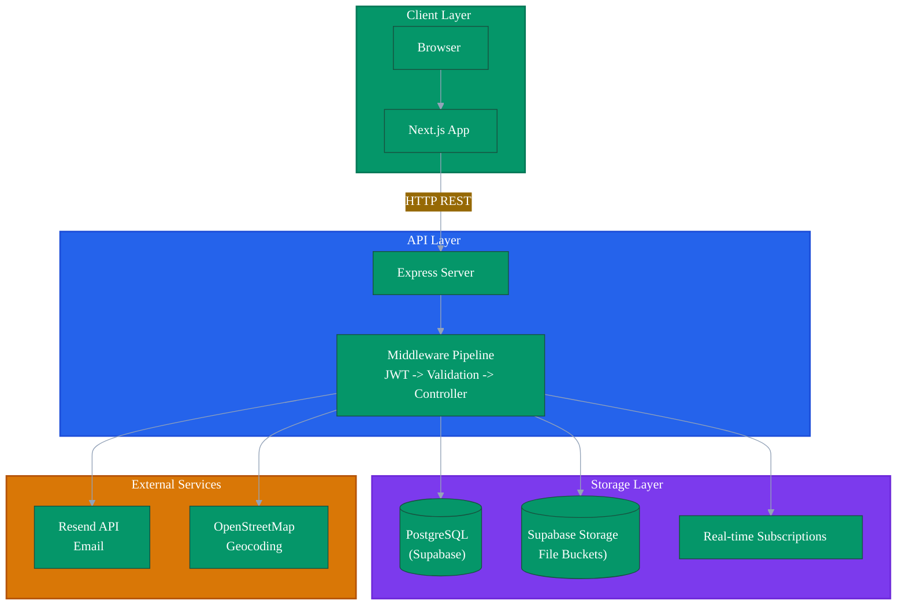
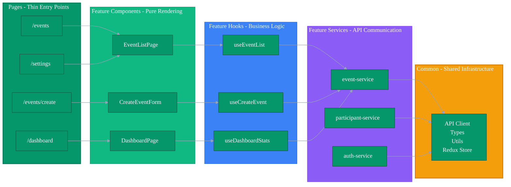
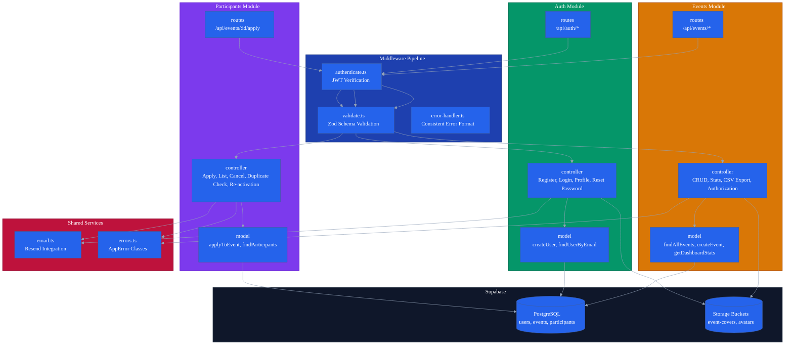
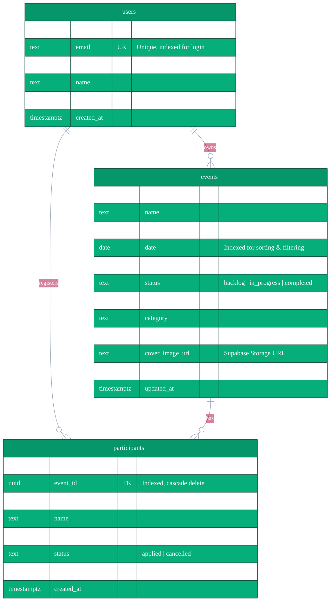
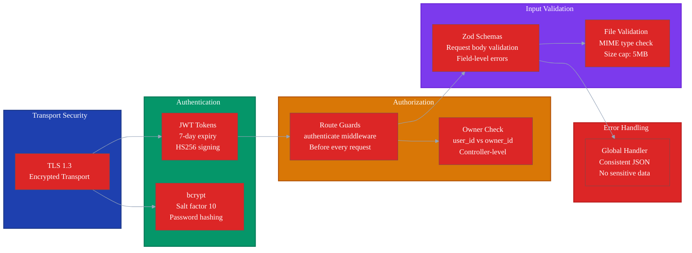

# Volunteer Yatra

A full-stack event management platform for volunteer organizations. Create, manage, and track events with participant registrations, real-time analytics, and cloud file storage. Built with Next.js, Express.js, and Supabase.

---

## Table of Contents

- [Overview](#overview)
- [Features](#features)
- [Tech Stack](#tech-stack)
- [Architecture](#architecture)
- [Database Design](#database-design)
- [File Storage](#file-storage)
- [Security Architecture](#security-architecture)
- [API Endpoints](#api-endpoints)
- [Getting Started](#getting-started)
- [Environment Variables](#environment-variables)

---

## Overview

Volunteer Yatra enables organizations to manage the complete lifecycle of volunteer events. Organizers create events with dates, locations, categories, capacity limits, and cover images. Volunteers discover and register for events. The dashboard provides real-time analytics, participant management, and CSV export.

**Core Infrastructure:**
- **Supabase** provides the PostgreSQL database, file storage buckets, and real-time subscriptions
- **Vercel** hosts the Next.js frontend for global CDN delivery
- **Resend API** handles transactional email notifications

---

## Features

**Authentication and User Management**
- Email/password registration with bcrypt hashing (salt factor 10)
- JWT-based stateless authentication with 7-day expiry
- Password reset flow with time-limited tokens
- Profile management with avatar upload to Supabase Storage

**Event Management**
- Full CRUD with date, time, location, category, capacity, and cover image
- Date range filtering and name search with server-side pagination
- Interactive Leaflet map display with OpenStreetMap geocoding
- CSV export with proper string escaping
- Status tracking: backlog, in progress, completed

**Participant Management**
- One-click registration with duplicate prevention (409 ALREADY_APPLIED)
- Automatic re-activation of previously cancelled registrations
- Capacity checks and registration deadline enforcement
- Email confirmation via Resend API (fire-and-forget)
- Owner-only participant view, add, and cancel operations

**Dashboard and Analytics**
- Real-time stats: total events, upcoming, participants, completion rate
- Adaptive trend intervals (daily, monthly, yearly) based on date range
- Status distribution pie chart and trend bar chart
- Supabase real-time subscriptions for live dashboard updates
- Sortable, filterable data tables with column visibility and resizing

**File Storage**
- Event cover images stored in Supabase Storage bucket
- User avatars stored in dedicated Supabase Storage bucket
- Image type validation (JPEG, PNG, WebP, GIF) and 5MB size limit

---

## Tech Stack

### Frontend

| Technology | Purpose |
|---|---|
| Next.js 15 | File-based routing, Turbopack, SSR |
| React 19 | Component library |
| TypeScript | Type safety |
| Tailwind CSS 4 | Utility-first styling with dark/light mode |
| Redux Toolkit + RTK Query | State management with automatic caching |
| TanStack Table | Sortable, resizable, filterable data tables |
| Leaflet + OpenStreetMap | Interactive maps with geocoding |
| Recharts | Bar charts and pie charts |
| Framer Motion | Page transitions and animations |
| Sonner | Toast notifications |
| Zod | Client-side form validation |
| date-fns | Date manipulation and formatting |

### Backend

| Technology | Purpose |
|---|---|
| Express.js 5 | HTTP server and routing |
| TypeScript | Type safety |
| Supabase Client | PostgreSQL queries, Storage API, real-time subscriptions |
| jsonwebtoken | JWT generation and verification |
| bcryptjs | Password hashing |
| Zod | Request body validation |
| Resend | Transactional email |
| Multer | File upload handling (legacy, migrated to Supabase Storage) |

### Infrastructure

| Technology | Purpose |
|---|---|
| Supabase | PostgreSQL database, file storage, real-time |
| Vercel | Frontend hosting with global CDN |
| Render / Railway | Backend hosting |
| Resend | Email delivery |

---

## Architecture

### System Overview



### Frontend Layer Architecture



### Backend Module Structure



---

## Database Design

### Entity Relationship Diagram



### Indexing Strategy

| Table | Column | Purpose |
|---|---|---|
| users | email | Fast login lookups |
| events | owner_id | Dashboard queries filtered by owner |
| events | date | Chronological sorting and date range queries |
| participants | event_id | Loading participants for event detail |
| participants | user_id | Looking up user's registrations |

### Data Integrity

- **Unique constraint** on (event_id, user_id) prevents duplicate registrations at database level
- **Cascade deletes** ensure referential integrity when events or users are removed
- **CHECK constraints** restrict status fields to allowed values
- **Foreign keys** guarantee every participant references a valid event and user

---

## File Storage

### Architecture Decision: Supabase Storage

The application migrated from local filesystem storage to Supabase Storage for durability, scalability, and performance.

| Before (Local FS) | After (Supabase Storage) |
|---|---|
| Files lost on server restart | Redundant cloud storage |
| Cannot scale horizontally | Decoupled from application server |
| Consumes server disk space | Pay-per-use object storage |
| Single point of failure | CDN-backed delivery |

### Storage Buckets

- **event-covers**: Public bucket for event cover images
- **avatars**: Public bucket for user profile photos

### Upload Flow

```
Client -> Express API -> Validate (type, size) -> Supabase Storage SDK -> Public URL -> Store in Database
```

- File validation: JPEG, PNG, WebP, GIF only
- Size limit: 5MB maximum
- Naming: UUID-based to prevent collisions
- URLs stored in PostgreSQL for retrieval

---

## Security Architecture



### Authentication Flow

```
User Login -> Backend Verifies Credentials -> JWT Generated (userId + 7-day expiry)
-> Token Sent to Client -> Stored in Memory -> Sent as Bearer Token on Every Request
-> authenticate Middleware Verifies -> Controller Executes
```

### Authorization Rules

- Event owners verified by comparing `req.userId` with `event.owner_id`
- Only owners can update, delete, change status of events
- Only owners can view participants and manage registrations
- All checks performed server-side at controller level

---

## API Endpoints

### Authentication

| Method | Endpoint | Auth | Description |
|---|---|---|---|
| POST | /api/auth/register | No | Create account, return JWT |
| POST | /api/auth/login | No | Authenticate, return JWT |
| GET | /api/auth/me | Yes | Get current user profile |
| POST | /api/auth/forgot-password | No | Request password reset email |
| POST | /api/auth/reset-password | No | Reset password with token |
| PATCH | /api/auth/profile | Yes | Update profile name and avatar |

### Events

| Method | Endpoint | Auth | Description |
|---|---|---|---|
| GET | /api/events | Yes | List with search, date range filter, status filter, pagination |
| GET | /api/events/stats | Yes | Dashboard analytics with date range |
| GET | /api/events/export/csv | Yes | Export filtered events as CSV |
| GET | /api/events/:eventId | Yes | Event detail with participant count |
| POST | /api/events | Yes | Create event |
| PUT | /api/events/:eventId | Yes | Update event (owner only) |
| PATCH | /api/events/:eventId/status | Yes | Update status (owner only) |
| DELETE | /api/events/:eventId | Yes | Delete event (owner only) |

### Participants

| Method | Endpoint | Auth | Description |
|---|---|---|---|
| POST | /api/events/:eventId/apply | Yes | Register with duplicate check |
| POST | /api/events/:eventId/participants/add | Yes | Manual add (owner only) |
| GET | /api/events/:eventId/participants | Yes | List participants (owner only) |
| DELETE | /api/events/:eventId/participants/:participantId | Yes | Cancel with reason (owner only) |

### File Upload

| Method | Endpoint | Auth | Description |
|---|---|---|---|
| POST | /api/upload | Yes | Upload to Supabase Storage |

---

## Getting Started

### Prerequisites

- Node.js 18+
- Supabase account (free tier)
- Resend account for email (optional)

### Setup

```bash
git clone <repository-url>
cd volunteerYatra

# Install dependencies
cd backend && npm install
cd ../frontend && npm install

# Configure Supabase
# 1. Create project in Supabase dashboard
# 2. Run migrations to create tables
# 3. Create Storage buckets: event-covers, avatars
# 4. Copy project URL and anon key

# Set environment variables (see table below)

# Start development
cd backend && npm run dev    # Port 4000
cd frontend && npm run dev    # Port 3000
```

---

## Environment Variables

### Backend (.env)

| Variable | Description |
|---|---|
| PORT | Server port (default: 4000) |
| SUPABASE_URL | Supabase project URL |
| SUPABASE_ANON_KEY | Supabase anonymous key |
| JWT_SECRET | Secret for signing JWT tokens |
| RESEND_API_KEY | Email API key (optional) |
| EMAIL_FROM | Sender email address |
| FRONTEND_URL | Frontend URL for password reset links |

### Frontend (.env.local)

| Variable | Description |
|---|---|
| NEXT_PUBLIC_API_URL | Backend API base URL |
| NEXT_PUBLIC_SUPABASE_URL | Supabase URL for real-time |
| NEXT_PUBLIC_SUPABASE_ANON_KEY | Supabase anon key for real-time |

---

## License

MIT
