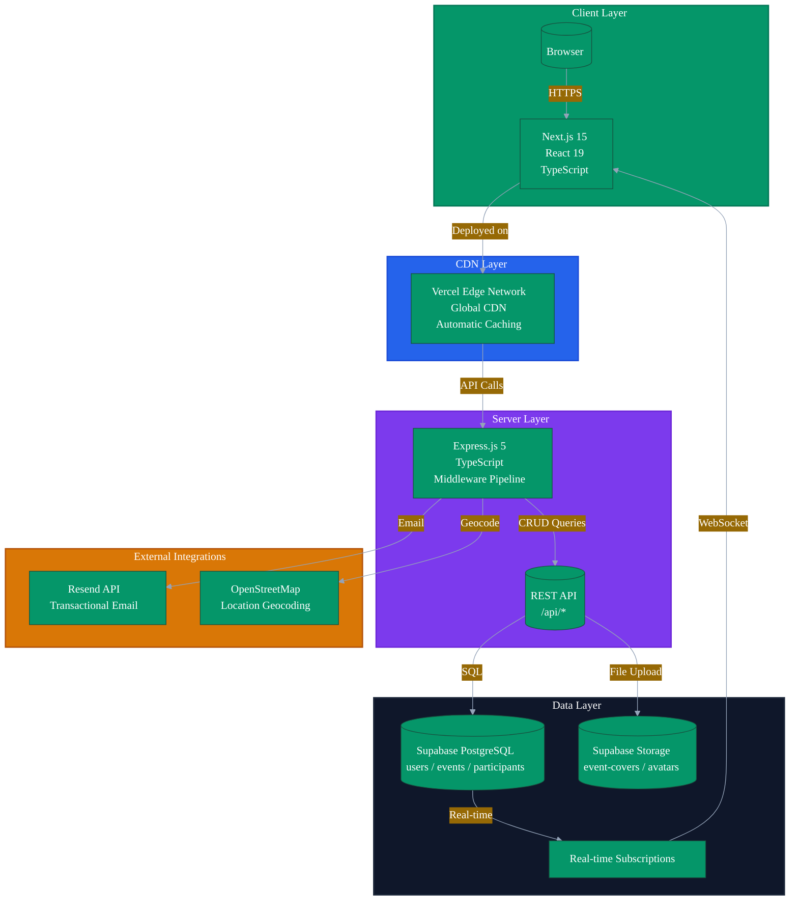
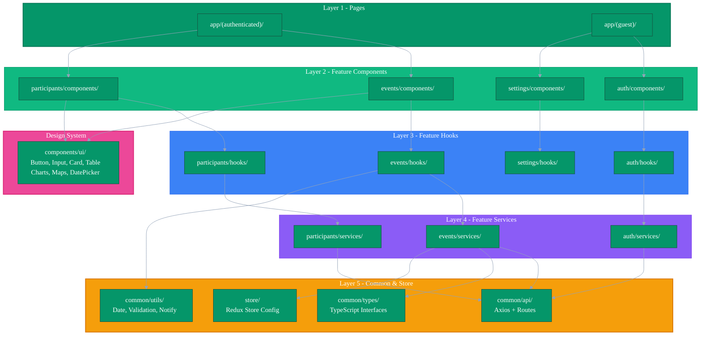
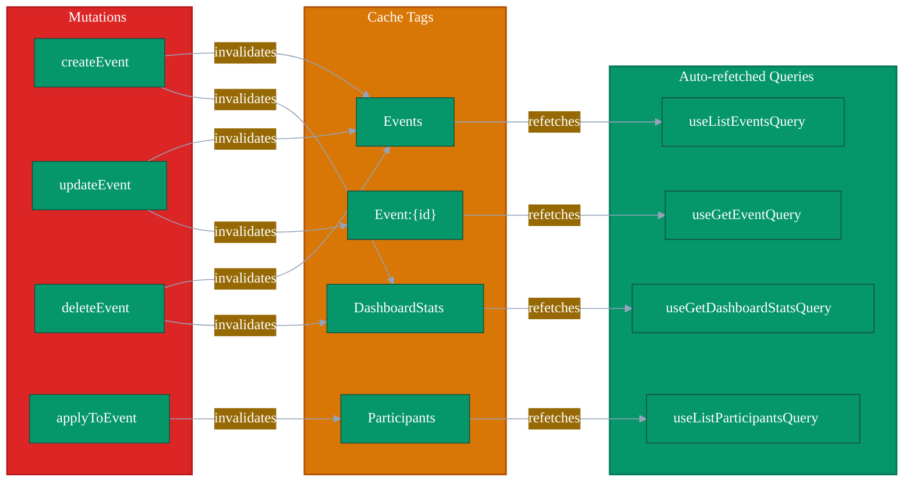
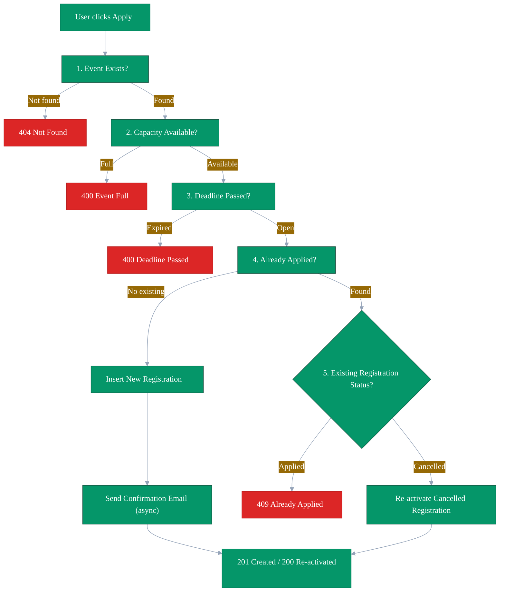
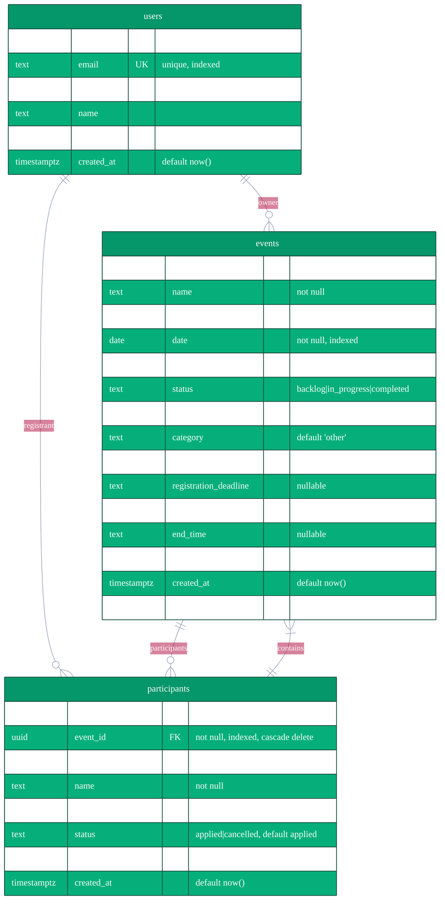
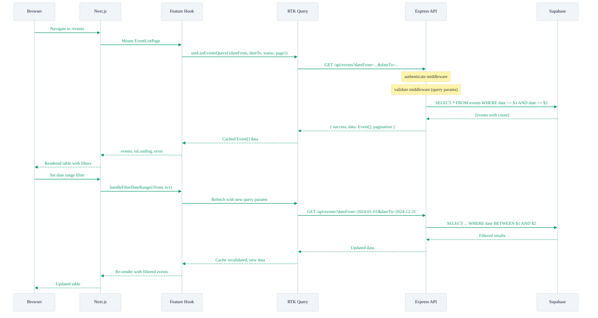
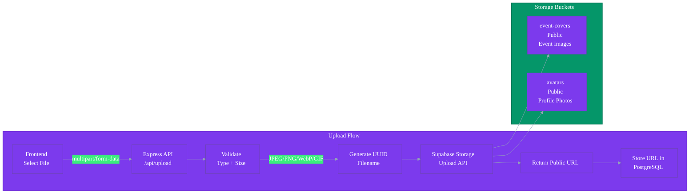
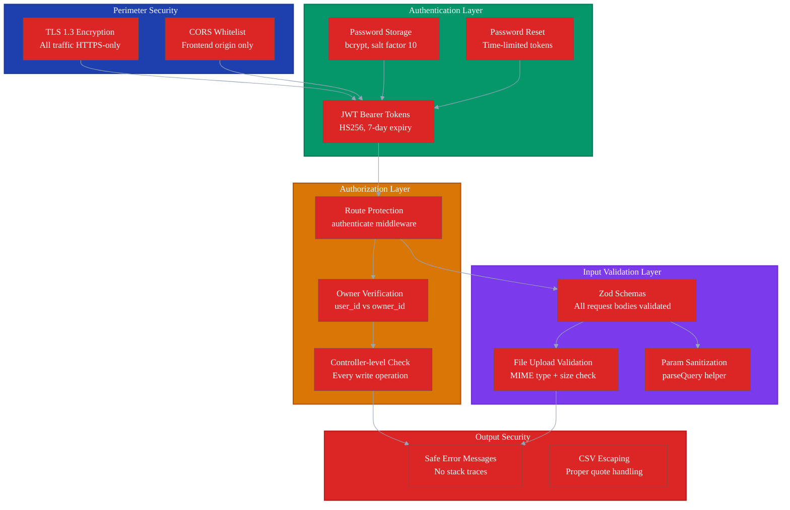
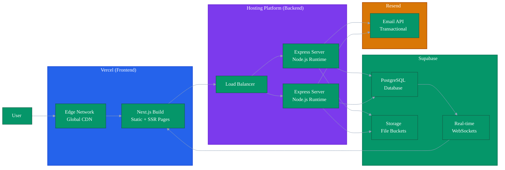

# System Design - Volunteer Yatra

A detailed technical overview of the system architecture, data flow, and design decisions behind the Volunteer Yatra platform.

---

## Table of Contents

- [System Architecture](#system-architecture)
- [Frontend Design](#frontend-design)
- [Backend Design](#backend-design)
- [Database Design](#database-design)
- [Data Flow](#data-flow)
- [File Storage Strategy](#file-storage-strategy)
- [Error Handling Strategy](#error-handling-strategy)
- [Security Architecture](#security-architecture)
- [Performance and Scalability](#performance-and-scalability)

---

## System Architecture



### Key Architectural Decisions

| Decision | Rationale | Trade-off |
|---|---|---|
| Supabase over raw PostgreSQL | Built-in real-time subscriptions, file storage, auth | Vendor lock-in, no custom extensions |
| RTK Query over React Query | Tight Redux integration, cache tag invalidation patterns | Larger bundle size |
| Server-side pagination | Scales to millions of events without client memory issues | More complex API queries |
| Fire-and-forget emails | API responses not blocked by email latency | No retry on failure guarantee |
| Supabase Storage over local FS | Horizontal scaling, CDN delivery, no disk management | Network latency for uploads |

---

## Frontend Design

### Layer Architecture

The frontend follows a strict unidirectional dependency model. Each layer can only import from layers below it.



### State Management with RTK Query



### Design System

The UI component library uses CSS variables for theming, enabling dark/light mode without component changes:

- **Button** - variants: primary, secondary, danger, ghost
- **DataTable** - sorting, resizing, column visibility, pagination, search
- **DateRangePicker** - presets (7d, 14d, 30d, 90d), custom range, dual-calendar
- **Charts** - bar charts, pie charts with adaptive intervals
- **Modal** - confirmation dialogs with loading states
- **Skeleton** - loading placeholders for every view

---

## Backend Design

### Module Structure

Each backend module follows a strict three-layer pattern:

```mermaid
%%{init: {'theme': 'base', 'themeVariables': { 'primaryColor': '#2563eb', 'primaryTextColor': '#fff', 'lineColor': '#94a3b8', 'fontFamily': 'Inter, sans-serif'}}}%%
flowchart TB
    subgraph Request["HTTP Request Flow"]
        REQ["Incoming Request"]
        AUTH["authenticate.ts\nJWT Verification"]
        VAL["validate.ts\nZod Schema"]
        CTRL["controller\nBusiness Logic"]
        RES["JSON Response"]
    end

    subgraph Module["Module Structure"]
        R["*.routes.ts\nEndpoints + Middleware"]
        C["*.controller.ts\nParse -> Authorize -> Call Model -> Respond"]
        M["*.model.ts\nSupabase Queries -> Typed Data"]
    end

    REQ --> AUTH
    AUTH --> VAL
    VAL --> CTRL
    CTRL --> RES

    R --> C
    C --> M

    style Request fill:#1e40af,color:#fff,stroke:#1e3a8a,stroke-width:2px
    style Module fill:#059669,color:#fff,stroke:#047857,stroke-width:2px
```



### Participant Registration Flow



---

## Database Design

### Entity Relationship Diagram



### Constraints and Integrity

| Constraint Type | Table | Columns | Purpose |
|---|---|---|---|
| Primary Key | users | id | Unique user identification |
| Primary Key | events | id | Unique event identification |
| Primary Key | participants | id | Unique participant identification |
| Unique | users | email | Prevent duplicate accounts |
| Unique | participants | event_id, user_id | Prevent duplicate registrations |
| Foreign Key | events | owner_id -> users.id | Ensure valid owner |
| Foreign Key | participants | event_id -> events.id | Ensure valid event |
| Foreign Key | participants | user_id -> users.id | Ensure valid user (nullable) |
| Check | events | status IN (backlog, in_progress, completed) | Valid status values |
| Check | participants | status IN (applied, cancelled) | Valid status values |

---

## Data Flow

### Complete Request Cycle



---

## File Storage Strategy

### Architecture Decision Record

**Context:** The application needed to store user avatars and event cover images. Initial implementation used the local server filesystem.

**Problem:** Local filesystem storage prevented horizontal scaling (files not shared across instances), consumed server disk space, and files were lost on redeploy.

**Decision:** Migrate to Supabase Storage.

**Consequences:**
- Files stored redundantly in cloud infrastructure
- Storage decoupled from application server (enables horizontal scaling)
- Files served via CDN for reduced server load
- Pay-per-use pricing eliminates wasted disk allocation

### Storage Architecture



### Validation Rules

| Check | Rule | Error Response |
|---|---|---|
| File type | JPEG, PNG, WebP, GIF | 400 INVALID_FILE_TYPE |
| File size | Max 5MB | 400 FILE_TOO_LARGE |
| No file | File required | 400 NO_FILE |

---

## Error Handling Strategy

### Consistent Error Responses

Every API error follows a uniform JSON structure:

```json
{
  "success": false,
  "error": {
    "code": "ERROR_CODE",
    "message": "Human-readable description"
  }
}
```

Validation errors include field-level details:

```json
{
  "success": false,
  "error": {
    "code": "VALIDATION_ERROR",
    "message": "Validation failed",
    "details": [
      { "field": "email", "message": "Invalid email format" },
      { "field": "name", "message": "Name is required" }
    ]
  }
}
```

### Error Classification

| Error Code | HTTP Status | Source | Description |
|---|---|---|---|
| VALIDATION_ERROR | 400 | Zod schemas | Request body or params fail validation |
| NOT_FOUND | 404 | Controller | Requested resource does not exist |
| AUTHENTICATION_ERROR | 401 | authenticate middleware | Missing, expired, or invalid JWT |
| FORBIDDEN | 403 | Controller | User lacks ownership permissions |
| ALREADY_APPLIED | 409 | participants controller | Duplicate registration attempt |
| DATABASE_ERROR | 500 | model layer | Supabase query error |
| EVENT_FULL | 400 | participants controller | Capacity limit reached |
| DEADLINE_PASSED | 400 | participants controller | Registration closed |

### Error Class Hierarchy

```
AppError (base class)
  +-- ValidationError (400, VALIDATION_ERROR)
  +-- NotFoundError (404, NOT_FOUND)
  +-- AuthenticationError (401, AUTHENTICATION_ERROR)
  +-- ForbiddenError (403, FORBIDDEN)
  +-- DatabaseError (500, DATABASE_ERROR)
```

Each class sets the HTTP status code and error code automatically, keeping error handling consistent across all controllers.

---

## Security Architecture

### Defense in Depth



### Security Measures Checklist

| Category | Measure | Implementation |
|---|---|---|
| Transport | TLS 1.3 | Vercel/HTTPS termination |
| Transport | CORS | Backend whitelist frontend origin |
| Authentication | JWT | HS256, 7-day expiry, Bearer token |
| Authentication | Password hashing | bcrypt, salt factor 10 |
| Authentication | Password reset | Time-limited tokens, email verification |
| Authorization | Owner check | req.userId vs event.owner_id |
| Authorization | Route guards | authenticate middleware on all protected routes |
| Validation | Request body | Zod schemas on every endpoint |
| Validation | File upload | MIME type check, 5MB size limit |
| Output | Error messages | Clean messages, no stack traces |
| Output | CSV export | Proper quote escaping for injection prevention |

---

## Performance and Scalability

### Caching Strategy

| Cache Layer | Mechanism | Benefit |
|---|---|---|
| Browser | RTK Query automatic caching | Instant page loads on revisit |
| Network | Next.js static generation | Pre-built pages served from CDN |
| Server | None (stateless API) | Enables horizontal scaling |
| Database | PostgreSQL indexes | Fast queries at any data size |

### Database Performance

- All WHERE clause columns are indexed
- Pagination uses Supabase .range() with LIMIT/OFFSET
- Count queries use `{ count: 'exact', head: true }` for performance
- Query filtering at database level, not in-memory

### Horizontal Scaling

The backend is fully stateless:
- No session data stored on server
- JWT contains all auth state
- Any instance can handle any request
- Load balancer distributes traffic arbitrarily

---

## Production Deployment

### Deployment Architecture



### Deployment Checklist

1. Set JWT_SECRET to a strong, unique value (min 32 characters)
2. Configure Supabase production project URL and anon key
3. Run database migrations on production Supabase project
4. Create Storage buckets: event-covers, avatars
5. Set bucket visibility rules (public for both)
6. Configure Resend API key for email delivery
7. Set FRONTEND_URL to production frontend domain
8. Enable HTTPS (automatic with Vercel)
9. Configure environment variables on deployment platform
10. Enable a process manager (PM2) or container orchestration for backend

### Monitoring

| Metric | Tool | Purpose |
|---|---|---|
| Uptime | /api/health endpoint | Basic health checks |
| API errors | Global error handler logs | Debugging production issues |
| Database performance | Supabase dashboard | Query performance monitoring |
| Frontend performance | Next.js Analytics | Core Web Vitals tracking |
